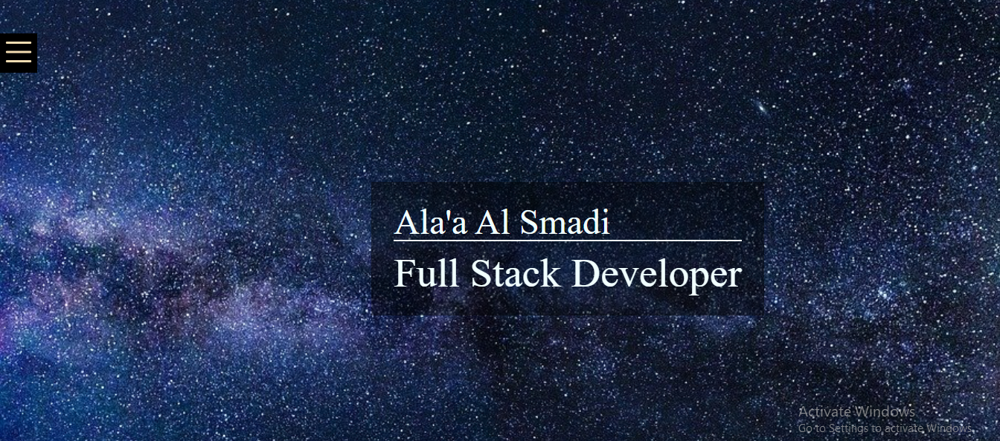

# HTML Web Template
-----

[Live Demo](https://alaan-smadi.github.io/Portfolio-Template/)

## Description
This is HTML based personal resume website template. I have built this by JavaScript (ES6), HTML5 and CSS3, it can be customized and used by anybody simply by filling in their own personal info into the JSON file and the changes will be dynamically fed into the site. If you would like to use this template for your own personal resume website, read on to learn how to build your own copy.

## Make it Your Own!
------------------------------
1. Make sure you have what you need
To build this website, you will need to have VS Code with ES6 downloaded and installed on your machine. If you don't already have it, you can get it [HERE](https://code.visualstudio.com/download)

2. Download the template
Once you forked this template by clicking on the button up in GitHub repo, download my code by hitting the green "clone or download" button above and hit download zip. If you run with live server now, you should see that your website renders the same as the one at the live demo link above.

3. Replace images and fonts
Next, you will want to replace the images, and fonts if you like, with your own. All you have to do is replace the images at assets/sky-Background.jpg, assets/profile.png and assets/favicon.png with your own. YOU MUST KEEP THE SAME NAMES ON THE IMAGES.

4. Fill in your personal info
To populate the website with all of your own data, open the json_files/myData.json and json_files/links_Arr.json file and simply replace the data in there with your own. Images for the porfolio section are to be put in the assets folder.

5. Make any styling changes you would like
Of course, all of the code is there and nothing is hidden from you so if you would like to make any other styling changes, feel free! 
I will be happy when I see better and greater styling that you add

6. Enjoy your new Resume Website
When you're all done, run with live server again and you'll see your new personal resume website! 
**Congratulations!**

